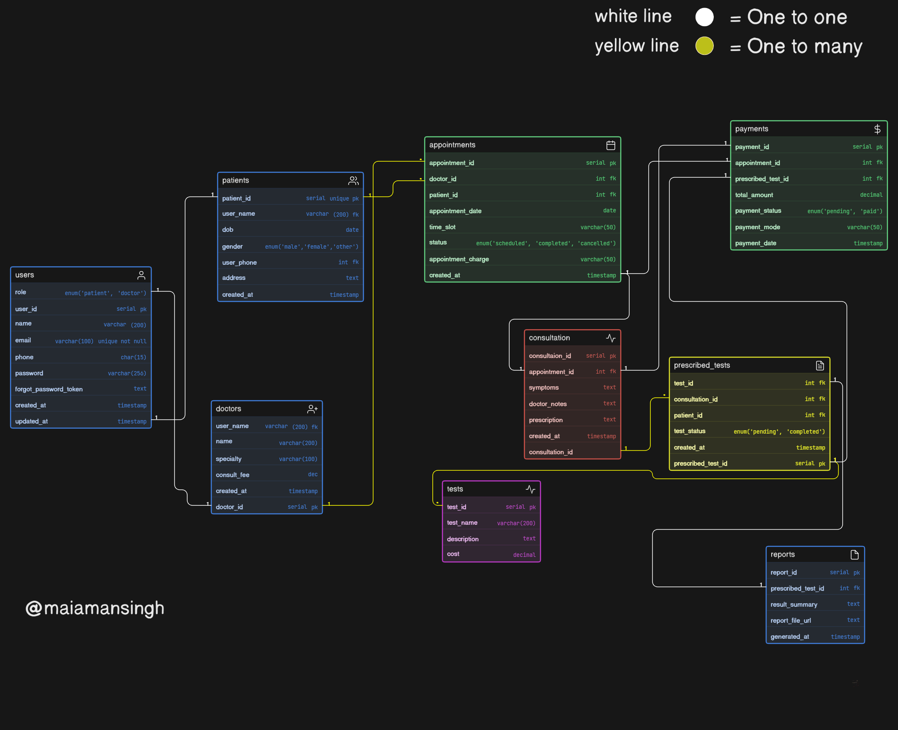

# Clinic Appointment & Diagnostics Platform - ER Diagram 🏥

## 📝 Project Overview
This database schema models the operational workflow of a modern clinic. It handles the complete patient journey: booking an appointment, attending a consultation, getting diagnostic tests prescribed, receiving reports, and processing payments.

## 🖼️ ER Diagram

## 🗄️ Database Architecture & Business Logic
The schema is designed to be scalable and strictly normalizes the clinic workflow.

* **Appointments vs. Consultations:** Separated into two entities. `Appointments` handle scheduling and cancellations, while `Consultations` (1-to-1 with appointments) handle the actual medical visit, doctor's notes, and prescriptions.
* **Diagnostics Workflow:** A `Diagnostic_Tests` table acts as a master catalog of available tests. A junction table `Prescribed_Tests` links these tests to a specific `Consultation`. 
* **Reports:** Linked directly to `Prescribed_Tests`, ensuring that every individual test gets its own distinct result report.
* **Payments:** Linked to the `Appointment` entity to act as a consolidated bill for both the consultation fee and any prescribed test charges.

## ⚙️ Key Decisions
* Avoided stuffing diagnostic data into the patient table.
* Handled the possibility of multiple diagnostic tests stemming from a single consultation using a junction table.

---
**Author:** Aman Singh | Web Dev Cohort 2026
