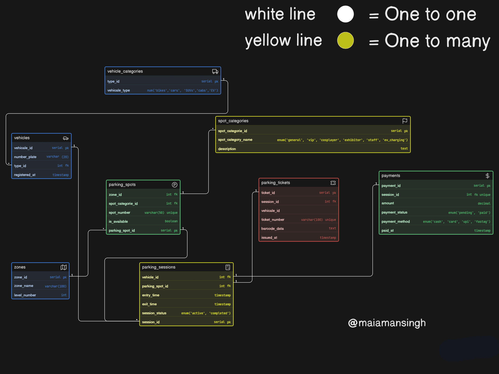

# Comic-Con Event Parking System - ER Diagram 🚗🎪

## 📝 Project Overview
This database schema models a scalable, multi-zone event parking system designed for large events like Comic-Con India. It effectively tracks vehicles, dynamic parking spot allocations, reserved access categories, ticketing, and payments while supporting multiple vehicle entries across different event days.

## 🖼️ ER Diagram

## 🗄️ Database Architecture & Business Logic
The core challenge of an event parking system is managing "reusability" (a spot is used multiple times, and a vehicle visits multiple times). This is solved through a highly normalized structure:

* **Parking Sessions (The Junction Entity):** Instead of linking a Vehicle directly to a Parking Spot, they are linked via the `parking_sessions` table. This allows the system to record `entry_time` and `exit_time`.
* **Spot Availability:** Tracked via an `is_available` boolean on the `parking_spots` table, which is toggled when a session starts/ends.
* **Access Categories:** `spot_categories` allow management to reserve specific spots for VIPs, Cosplayers, Staff, and EV Charging independently of the physical `zones`.
* **Vehicle Differentiation:** `vehicle_types` (Bike, SUV, Cab) dictate which spots can be assigned.
* **Separation of Concerns:** `Tickets` (physical/digital entry pass) and `Payments` (exit billing) are decoupled into their own tables linked 1-to-1 with the `parking_sessions` table.

---
**Author:** Aman Singh | Web Dev Cohort 2026