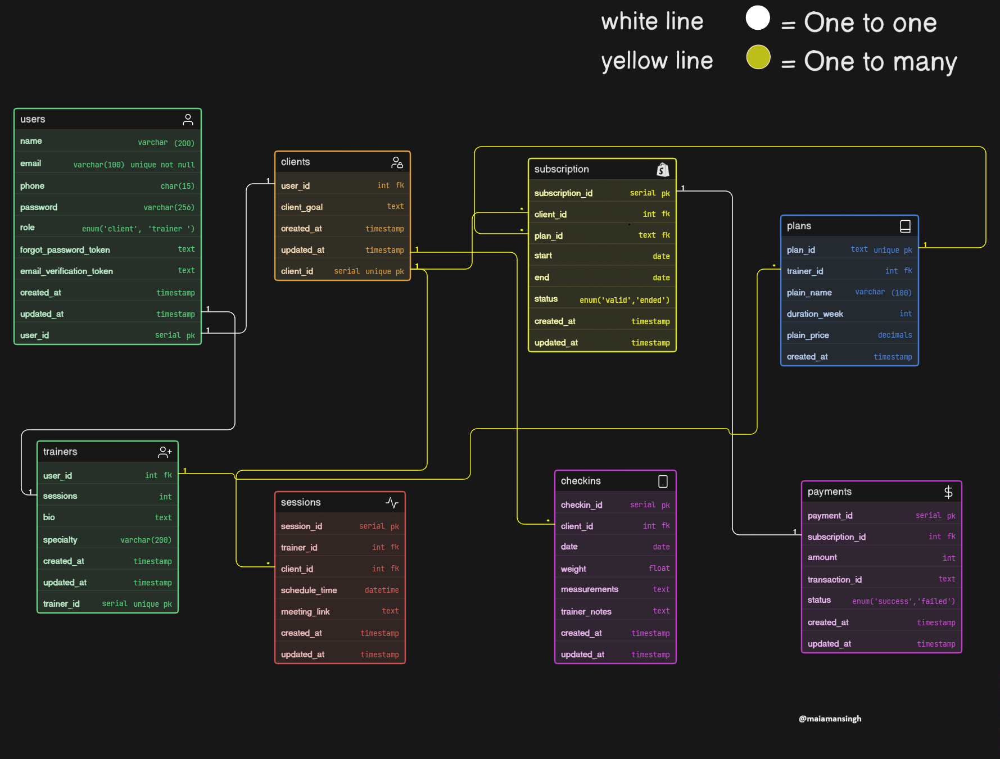

# Fitness Influencer Coaching Platform - Database Schema 🏋️‍♂️

## 📝 Project Overview
This repository contains the Entity-Relationship (ER) diagram and database schema for an online fitness coaching ecosystem. Unlike traditional gym management systems, this platform is designed for fitness influencers and coaches to manage clients, sell subscription-based plans, schedule live consultations, and track weekly progress.

## 🖼️ ER Diagram
*(Please ensure the exported ER diagram image is uploaded to the repository as `er-diagram.png`)*

## 🗄️ Database Architecture
The schema is highly normalized to handle the complex relationships between users, subscriptions, and asynchronous progress tracking.

### Core Entities & Relationships:
* **Users, Clients & Trainers:** Implements role-based access. The `users` table handles authentication, while `clients` and `trainers` have specific profiles linked via a 1-to-1 relationship.
* **Plans:** Stores the coaching programs created by trainers (e.g., 90-Day Fat Loss, 1-on-1 Consultation).
* **Subscriptions (Junction Table):** Manages the **Many-to-Many** relationship between Clients and Plans, tracking the start/end dates and active status of purchased programs.
* **Sessions:** Handles scheduled live video consultations (1-to-Many from both Trainer and Client perspectives).
* **Check-ins:** Separated from standard sessions to specifically handle asynchronous weekly progress tracking (weight, measurements, and trainer notes).
* **Payments:** Securely tracks transaction statuses linked to specific subscriptions.

## ⚙️ Key Technical Decisions
* **Data Normalization:** Extracted overlapping user details (name, email) into a central `users` table to prevent data duplication in client and trainer profiles.
* **Separation of Concerns:** Clear distinction between `Sessions` (scheduled live events with meeting links) and `Check-ins` (data-driven progress updates).

---
**Author:** Aman Singh
**Cohort:** Web Dev Cohort 2026