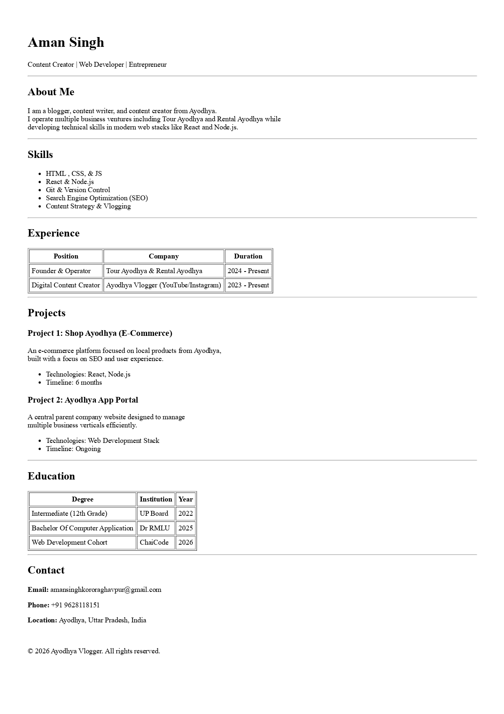

# HTML Resume Page Assignment

---

## 📝 Project Overview
This is a single-page resume website built entirely with **pure HTML** as part of the **Web Development Cohort 2026**. The goal of this assignment was to practice semantic HTML tags, table structures, and lists without using any CSS. It represents my first step in building a professional digital presence for my business ventures in Ayodhya.

---

## ✨ Features
* **Semantic Structure:** Uses tags like `<header>`, `<section>`, and `<footer>` for better readability and accessibility.
* **Data Tables:** Professional experience and education details are organized using clean HTML tables.
* **Clean Layout:** Utilizes horizontal rules (`
`) to separate sections like "About Me," "Skills," and "Projects" for visual clarity.
* **Contact Information:** Includes active email links and localized contact details.

---

## 📸 Screenshots
Below is a preview of the final output:

> **Note:** Ensure the image file `Aman Singh Resume.jpg` is uploaded to your root folder for this to display correctly.

---

## 🚀 Live Demo
You can view the live version of this project here:
[**View Live Resume**](https://my-resume-kohl-seven.vercel.app/)

---

## 🛠️ Technologies Used
* **HTML5:** Structure and Semantics

---

## 👤 Author
**Aman Singh**
* **Role:** Content Creator, Web Developer, and Entrepreneur
* **Business:** Founder of Tour Ayodhya & Rental Ayodhya
* **Contact:** amansinghkororaghavpur@gmail.com

---

Built with ☕ and Code during the 2026 Web Dev Cohort.
