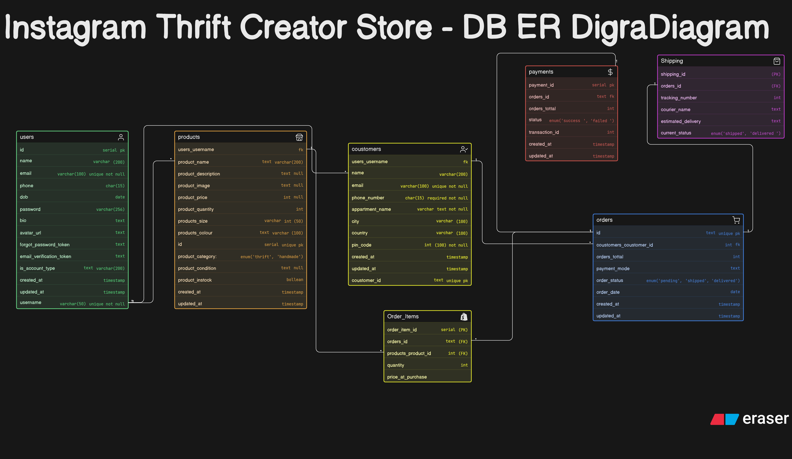

# Instagram Thrift & Handmade Store - Database ER Diagram 🛍️

## 📝 Project Description
This repository contains the Entity-Relationship (ER) diagram for a growing Instagram-based creator store. The database is designed to handle the unique business logic of selling both **Thrifted items** (unique, single-stock, condition-specific) and **Handmade items** (batch production, multiple sizes/colors, reusable inventory).

## 🖼️ ER Diagram
*(Make sure to upload your exported image in the repository and update the image name below if it's different)*

## 🗄️ Database Schema Highlights
The design follows a clean, normalized relational model to efficiently track customers, inventory, orders, and fulfillment. 

### Core Entities:
* **Users/Vendors:** Manages the creator's profile and store details.
* **Products:** Handles both `thrift` and `handmade` items. Uses Enums to differentiate types and maintains stock quantities (Thrift items are strictly locked to a quantity of 1).
* **Customers:** Stores details of the buyers placing orders via DMs/WhatsApp.
* **Orders & Order_Items:** Uses a junction table (`Order_Items`) to establish a **Many-to-Many** relationship, allowing a single order to contain multiple products while preserving historical pricing.
* **Payments:** Tracks transaction status (`success`, `failed`, `pending`) and modes.
* **Shipping:** Tracks courier details, tracking numbers, and delivery states (`shipped`, `delivered`).

## ⚙️ Key Technical Decisions
* **Normalization:** Separated `Payments` and `Shipping` from the `Orders` table to keep the design clean.
* **Enums:** Utilized Enums for `product_category`, `order_status`, and `payment_status` to ensure data consistency.
* **Scalability:** Designed to support multiple vendors/users in the future if the platform expands beyond a single creator.

---
**Author:** Aman Singh
**Cohort:** Web Dev Cohort 2026