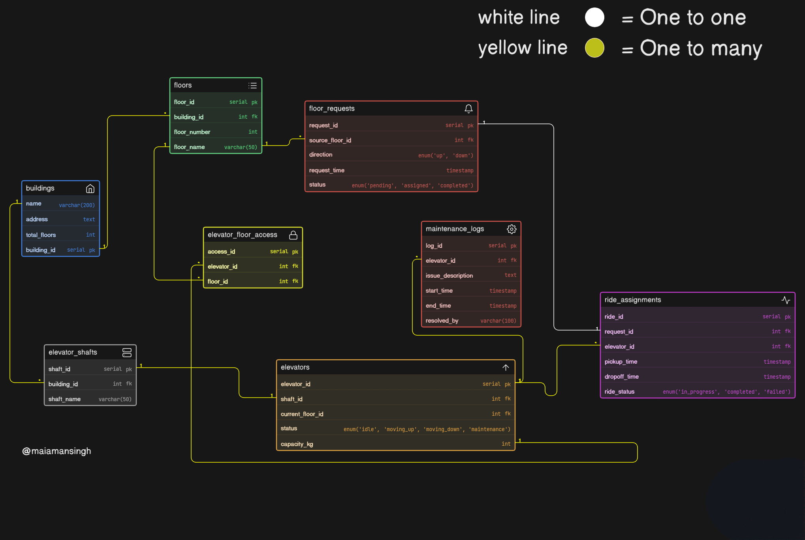

# Smart Elevator Control System - ER Diagram 🛗

## 📝 Project Overview
This repository contains the Entity-Relationship (ER) diagram for **LiftGrid Systems**, a smart infrastructure platform designed to manage and monitor multiple elevators across high-rise buildings. The system tracks dynamic ride requests, elevator allocation, and operational maintenance.

## 🖼️ ER Diagram

## 🗄️ Database Architecture & Business Logic
Designing for infrastructure requires strict separation of configuration (static) and operational (dynamic) data. 

### Key Architectural Decisions:
* **Elevator Floor Access (Junction Table):** In high-rise buildings, not all elevators serve all floors. The `elevator_floor_access` table manages exactly which elevator is configured to stop at which floor.
* **Separation of Requests and Rides:** A user pressing a button creates a `floor_request`. The dispatch algorithm then creates a `ride_assignment` linking that request to the most optimal `elevator`. This prevents dynamic trip data from bloating the core elevator entity.
* **Non-Destructive Maintenance Logs:** Elevator status (idle, moving, maintenance) is kept as an Enum in the `elevators` table for real-time tracking, while the actual history of repairs is recorded in a separate `maintenance_logs` table for long-term analytics.

---
**Author:** Aman Singh | Web Dev Cohort 2026