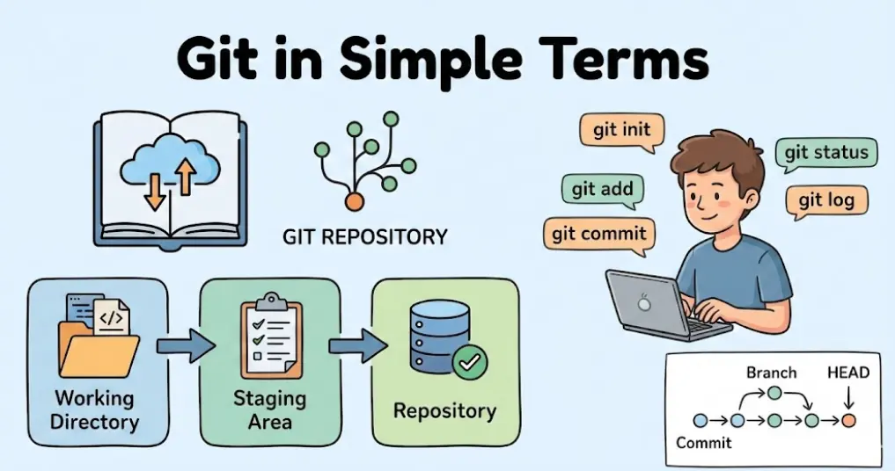
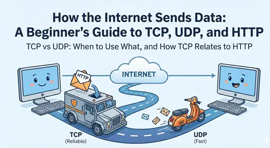

<a href="./">
  <h1 align="center">Blogs Archive</h1>
</a>

  Showcase of my journey to building a solid Foundation.

&nbsp;&nbsp;&nbsp;&nbsp;&nbsp;&nbsp;

 

### [Git for Beginners: A Simple Guide to Version Control](https://maiamansingh.hashnode.dev/git-for-beginners-a-simple-guide-to-version-control)

  <a href="https://maiamansingh.hashnode.dev/git-for-beginners-a-simple-guide-to-version-control">
      

      
    

  </a>

### [Inside Git: How It Works and the Role of the .git Folder](https://maiamansingh.hashnode.dev/inside-git-how-it-works-and-the-role-of-the-git-folder)

<a href="https://maiamansingh.hashnode.dev/inside-git-how-it-works-and-the-role-of-the-git-folder">
      

      
    

  </a>

  ### [Why Version Control Exists: The Pendrive Problem](https://maiamansingh.hashnode.dev/why-version-control-exists-the-pendrive-problem)

<a href="https://maiamansingh.hashnode.dev/why-version-control-exists-the-pendrive-problem">
      

      
    

  </a>
  
  ### [Understanding Network Devices](https://maiamansingh.hashnode.dev/understanding-network-devices)

<a href="https://maiamansingh.hashnode.dev/understanding-network-devices">
      

      
    

  </a>

  ### [DNS Record Types Explained](https://maiamansingh.hashnode.dev/dns-record-types-explained)

<a href="https://maiamansingh.hashnode.dev/dns-record-types-explained">
      

      
    

  </a>

  ### [Getting Started with cURL](https://maiamansingh.hashnode.dev/getting-started-with-curl)

<a href="https://maiamansingh.hashnode.dev/getting-started-with-curl">
      

      
    

  </a>
 
  ### [How DNS Resolution Works](https://maiamansingh.hashnode.dev/how-dns-resolution-works)

<a href="https://maiamansingh.hashnode.dev/how-dns-resolution-works">
      

      
    

  </a>
  
  ### [TCP vs UDP When to Use What, and How TCP Relates to HTTP](https://maiamansingh.hashnode.dev/tcp-vs-udp-when-to-use-what-and-how-tcp-relates-to-http)

<a href="https://maiamansingh.hashnode.dev/tcp-vs-udp-when-to-use-what-and-how-tcp-relates-to-http">
      

      
    

  </a>

 

