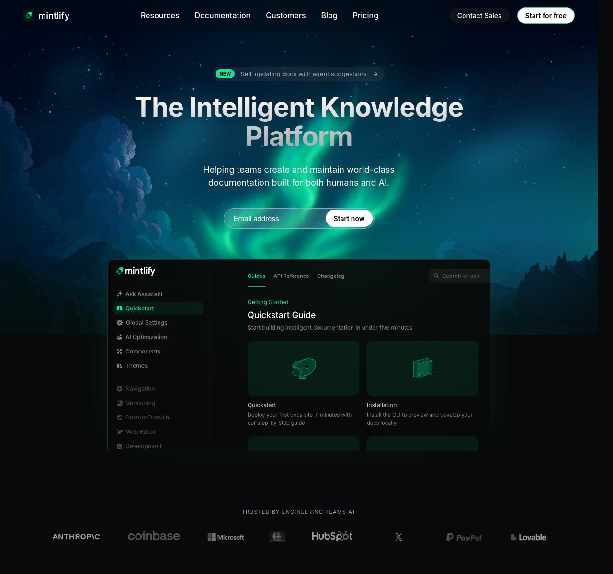

# Mintlify Landing Page Clone

## Overview
Desktop-first visual recreation of the Mintlify documentation platform landing page using only HTML and CSS. This project focuses on high-fidelity layout accuracy, gradients, and glassmorphism effects without relying on JavaScript frameworks.

## Sections Implemented
- Navigation Bar (Sticky with blur effect)
- Hero Section (Glow effects & UI Mockup)
- Trusted By Logos
- Feature Highlights (Alternating layout)
- Intelligent Assistant UI
- Enterprise Features Grid
- Customer Stories (CSS-only horizontal scroll)
- Final Call-to-Action
- Footer (Multi-column)

## Fonts Used
- Inter (System UI)
- Geist Mono

## Color Palette
- Background: Woodsmoke (`#08090B`)
- Primary Accent: Mountain Meadow (`#18E299`)
- Secondary: Soft Black (`#111215`)
- Text: White & Muted Gray (`#9CA3AF`)

## Constraints Followed
- No JavaScript
- No frameworks (Tailwind, Bootstrap, etc.)
- Desktop-first design
- HTML + CSS only

## 🚀 Live Demo
You can view the live version of this project here:
[**View Live Demo**](https://mintlify-clone-lyart.vercel.app//)

---

## Screenshots

## Live Demo
[**View Live **](https://mintlify-clone-lyart.vercel.app//)